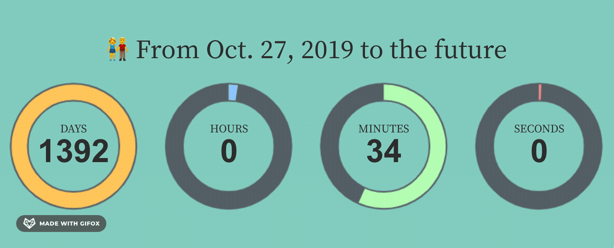
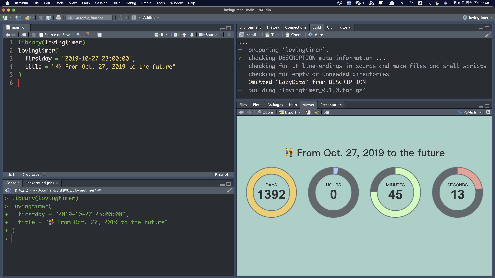
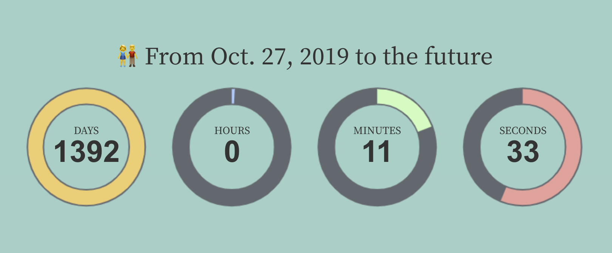
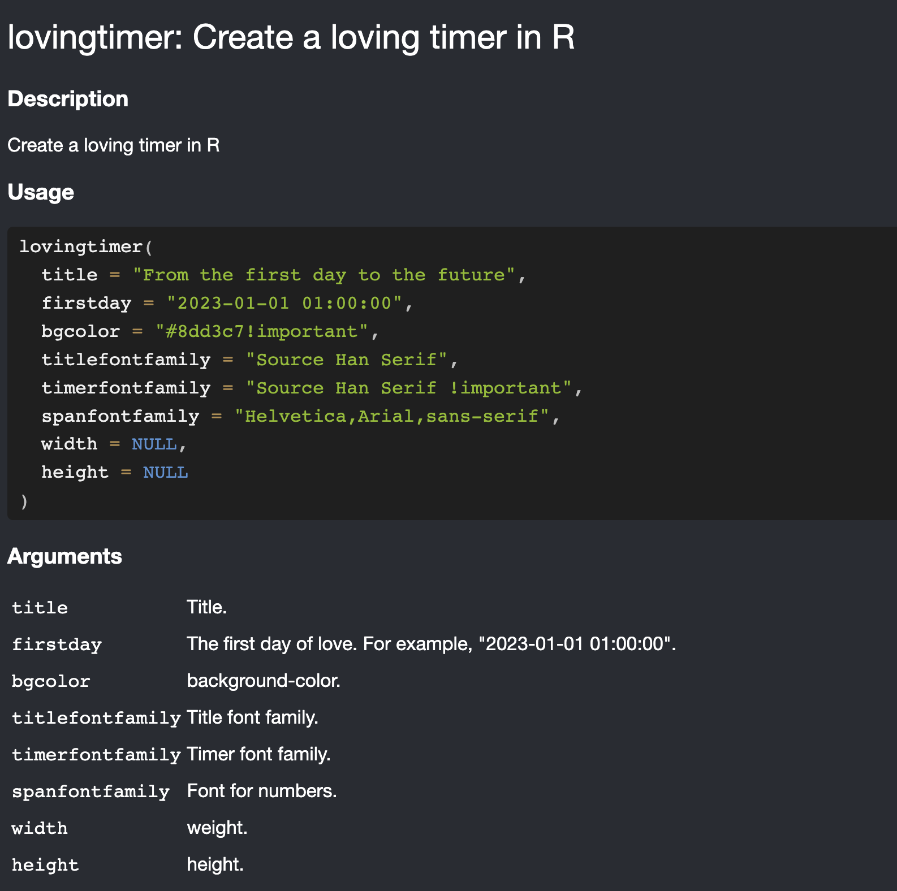
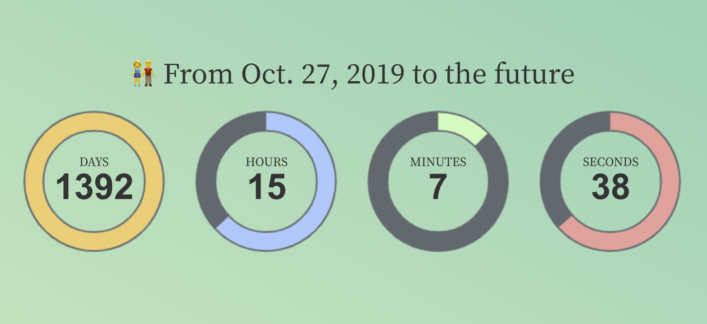
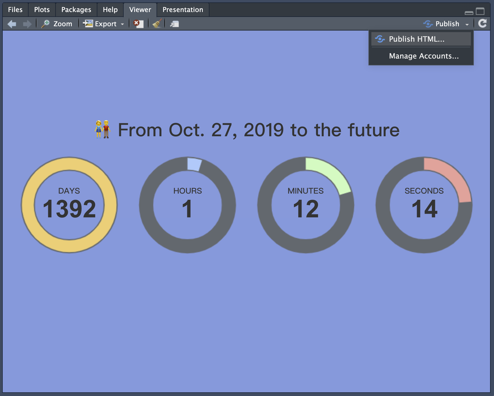
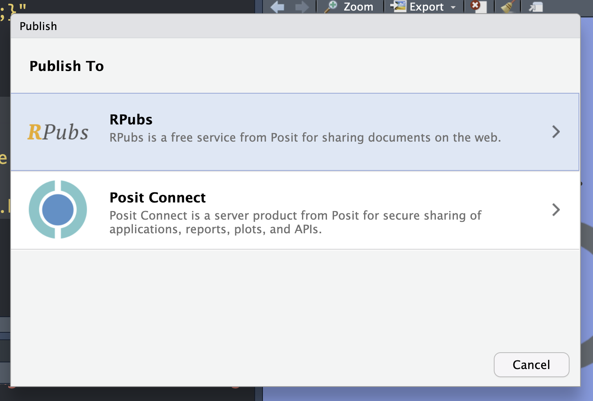
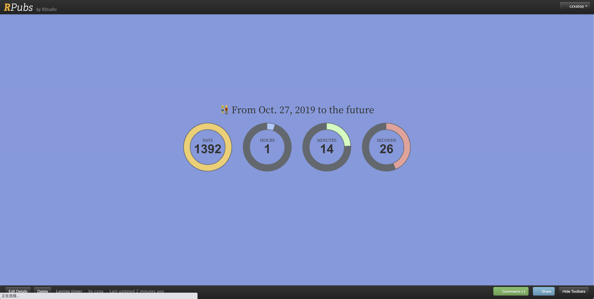

# lovingtimer: Create a loving timer

爱意东升西落，浪漫至死不渝。值此七夕佳节，给大家分享一个有趣的 R 包。是我特意为今年七夕编写的～



使用该 R 包可以在 1s 中生成这样的一个「恋爱计时器」。

## 安装 lovingtimer 包

这个包被我放到了 GitHub 上，因此大家可以运行下面的代码安装：

```r
devtools::install_github("r-stata/lovingtimer")
```

## 加载 lovingtimer 包

R 包在使用前需要先加载：

```r
library(lovingtimer)
```

## 运行 lovingtimer() 函数

然后运行 lovingtimer() 函数就可以创建一个恋爱计时器了：

```r
lovingtimer::lovingtimer(
  firstday = "2019-10-27 23:00:00", 
  title = "👫 From Oct. 27, 2019 to the future"
)
```



## 设置字体

在 RStudio 里面看不出来字体的效果，不过如果在浏览器中打开会看到默认的字体是思源宋体：



在 lovingtimer() 函数中我设置了三个字体参数，分别可以用来设置第一行文字、计时器里面的 Days/Hours/Minutes/Seconds 和 计时器上的数字的字体：



其中 firstday 就是你和你的爱人在一起的第一天了，width 和 height 在这个地方是没用的参数（这个包的构建方法和一般的 htmlwidgets 包不太一样）。

这里的字体名称比较灵活，可以设置单个，也可以设置多个（实际上是为了避免某些浏览器不支持个别字体，准备的备选字体）。!important 表示这个优先。

## 高级设置：CSS

如果你还会一些 CSS，就可以继续深入的设置这个计时器了，例如给计时器的背景换个颜色，使用渐变色背景：

```r
lovingtimer(
  firstday = "2019-10-27 23:00:00",
  title = "👫 From Oct. 27, 2019 to the future",
  bgcolor = ""
) %>%
  htmlwidgets::appendContent(
    htmltools::tag(
      "style",
      "body {background: linear-gradient(to bottom left, #47C9AF 0%, #D9F5BE 100%) 100% no-repeat !important;height:1000px}"
    )
  )
```



也可以使用图片作为背景，注意要选择长宽恰当的图片：

```r
lovingtimer(
  firstday = "2019-10-27 23:00:00",
  title = "👫 From Oct. 27, 2019 to the future",
  bgcolor = ""
) %>%
  htmlwidgets::appendContent(
    htmltools::tag(
      "style",
      paste0("body {background-image: url(", "data:image/png;base64,", base64enc::base64encode("bgpic.png"), ");}")
    )
  )
```


## 保存为 html 文件

由于该包是基于 htmlwidgets 开发的，所以可以使用  htmlwidgets::saveWidget() 保存成 html 文件：

```r
lovingtimer(
  firstday = "2019-10-27 23:00:00",
  title = "👫 From Oct. 27, 2019 to the future"
) %>% 
  htmlwidgets::saveWidget("lovingtimer.html")
```

然后就可以发给你的另一半啦！

## 发表为网页

html 文件可能在手机上难以查看，这样你的另一半可能就收不到你的心意，所以最好生成一个网址，可以使用 RStudio 自带的文档发布服务：



然后选择 RPubs(会需要登录注册)：



然后按照网页的指引设置网址链接就可以啦：



然后就可以把这个页面的链接发给你的另一半了，随时随地，各种设备都可以访问了！

## 祝天下有情人终成眷属

记住两个人相爱过程中那些重要的日子或许就是最好的礼物了，祝大家有情终成眷属，爱情美满，事业有成！七夕佳节快乐～
